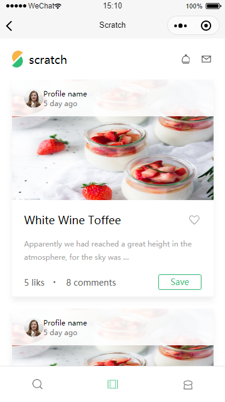
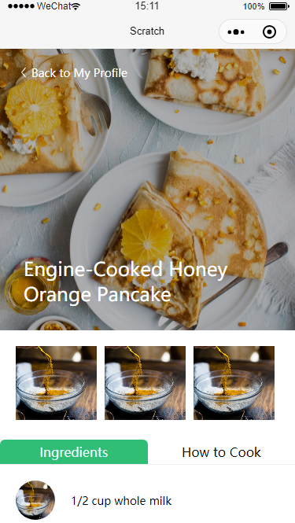
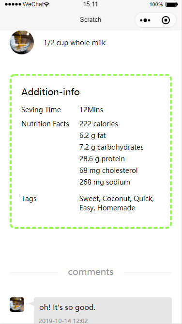

# 前言

有一年多没有关注小程序，发现小程序多了一些新鲜的内容，特意来尝试一下。

# 进度

说实话，微信小程序和一年前相比增加了很多内容，比如：自定义组件的内容。这几天主要就看这块的内容了，顺便实现了一个简单的tabs标签页组件。

下边是我这几天完成的一些样式，由于文档内容比较多，导致很多时间都花在文档上边了，页面完成的进度可能就比较慢。

首页的食谱列表

食谱的详情页面

设计稿是我从网上找的，写的时候没有什么好的想法，这次写项目的目的可能还是以熟悉小程序的内容为主，写什么就不显得那么重要了。

# 问题

1. 小程序组件的 `properties` 和 `vue` 的 `props`还是有差别的，修改非引用类型的 `props` vue是不允许的，而小程序可以，这是我在写组件的时候发现的。

2. vue里边一切都是组件，但是小程序貌似将页面和组件分的比较清楚，所以生命周期方面都不太一样

3. 小程序组件还有relations这个属性，通过这个才可以拿到子组件的数据

4. 小程序的控制台在调试的时候只能看到页面级别的数据变化，无法观察到组件的数据变化，感觉不是很方便。不确定有么有插件，目前没有太关注这个。

# 云开发 quickstart

这是云开发的快速启动指引，其中演示了如何上手使用云开发的三大基础能力：

- 数据库：一个既可在小程序前端操作，也能在云函数中读写的 JSON 文档型数据库
- 文件存储：在小程序前端直接上传/下载云端文件，在云开发控制台可视化管理
- 云函数：在云端运行的代码，微信私有协议天然鉴权，开发者只需编写业务逻辑代码

## 参考文档

- [云开发文档](https://developers.weixin.qq.com/miniprogram/dev/wxcloud/basis/getting-started.html)

